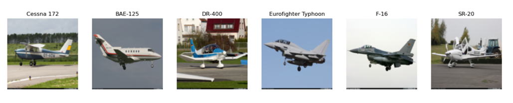

# Tutorial on Different Image Classification Networks applied to Aircraft Dataset


## Objective

Compare the classification accuracy of a simple built-from-scratch CNN model to the pretrained CNN models, ResNet-152 and VGG-16, using the FGVC Aircraft image dataset. 

*  Examine classification for different subsets of the aircraft families
*  Demonstrate how to track the loss and accuracy during training and validation using Tensorboard

We want to 
1. visualize the dataset
2. train a deep neural network to classify images of the different aircraft models (CNN, ResNet152, VGG16)

---------------------------------------

## Computational Details

* Train-validation split ratio: 50/50 split
* Batch size: 128
* Learning rate: 0.001
* Optimization algorithm: stochastic gradient descent
* Loss function: Cross Entropy Loss
* 100 epochs

**Simple made-from-scratch CNN Model**
* Activation function: ReLU
* 3x3 Kernel size in convolutional layers
* Max pooling with 2x2 Kernel size
* 9 layers (8 Convolutional layers + 1 fully connected layer)

**Pretrained models**
* ResNet-152
* VGG-16

## Dataset

The FGVC-Aircraft dataset containing 10,000 images of aircraft (covering 100 different models) can be downloaded at 
https://www.robots.ox.ac.uk/~vgg/data/fgvc-aircraft/#:~:text=FGVC%2DAircraft%20Benchmark,375%20KB%20%7C%20MD5%20Sum%5D.

The dataset is discussed in the paper "Fine-Grained Visual Classification of Aircraft" by Maji, et al [2013] which can be found at https://arxiv.org/abs/1306.5151

### 10,000 images of aircraft:

* 100 Model Variants (e.g. Boeing 737-700) 

* 70 Families (e.g. Boeing 737) 

* 30 Manufacturers (e.g. Boeing)


I modified the file structure a bit and have the re-structured code available for download at:

https://drive.google.com/file/d/1GMujsV2_kqMsbDAaEPgO-4hyYHkckjjW/view?usp=sharing


Unzip the data.zip file (see directory tree structure below). 

There are also many family classes for the aircraft (70 categories!), so I chose to reduce it to just the Airbus fleets (6 classes): ['Cessna 172','BAE-125','DR-400','Eurofighter Typhoon','Boeing 747','SR-20'].

For logging later on, optionally add a folder called log_test. Your directory structure should look like:
```
May-2022-Aircraft-Image-Classification/

   log_test/
   data/
      train
         (various image files...)
          labels.csv
      valid
         (various image files...)
          labels.csv
   code/
      __init__.py
      models.py
      train.py
      utils.py
      PlotCNNprediction.py
      PlotDatasetImages.py
   ```
 ---------------------------------------------------------------------------------------
 
## Install dependencies

<code> python -m pip install -r requirements.txt </code>

and if you are using conda use:

<code> conda env create aircraft.yml </code>

which can be activated for your Python environment using: 

<code> conda activate aircraft </code>

--------------------------------------------------------------------------------------------------------
## Training

Currently, in the folder code, you can train the models using a convolutional neural network and ResNet 152.


To train the CNN, the code is: 

<code> python -m code.train -m cnn </code>

To train the ResNet, the code is: 

<code> python -m code.train -m resnet </code>

To train VGG-16, the code is: 

<code> python -m code.train -m vgg </code>

---------------------------------------------------------------------

## Visualization

Here is the code you can run before training the model to see a snapshot of what the dataset looks like:

<code> python -m code.PlotDatasetImages data/train  </code>



To visualize the results of our model on the validation data, you can plot the following:

<code> python -m code.PlotCNNprediction -model resnet -dataset data/valid </code>

and compare with performance on the training set:

<code> python -m code.PlotCNNprediction -model resnet -dataset data/train </code>

_____________________________________________________________________

## Using TensorBoard

If you want to use Tensorboard, here is some extra code:

<code> python -m code.train -m cnn --log_dir log_test -n 1000 </code>

followed by:

<code> tensorboard --logdir=log_test --port 6006 --bind_all  </code>
             
the message you'll receive will give you something like:

<code> http://your-Laptop-name:6006/ </code>

click on the address you get and open it in a web browser. See the interactive tensorboard. Done!

## Results

The models are overfit, but nevertheless VGG-16 stands out as the best model of the bunch. 70 different aircraft (some of which look very similar) is pretty difficult to classify accurately! So, if you gave VGG-16 a random image of an aircraft, it could guess what it is with almost 50% accuracy (out of 70 families). That may not sound impressive but is remarkable considering the ostensible indistinguishability of so many aircraft models. 


